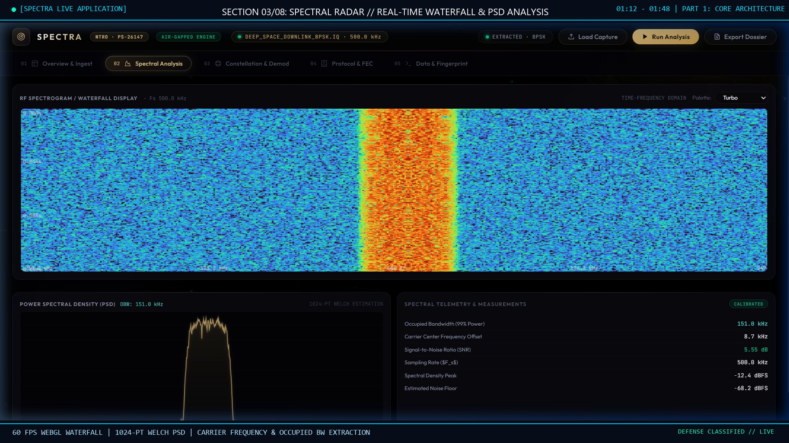
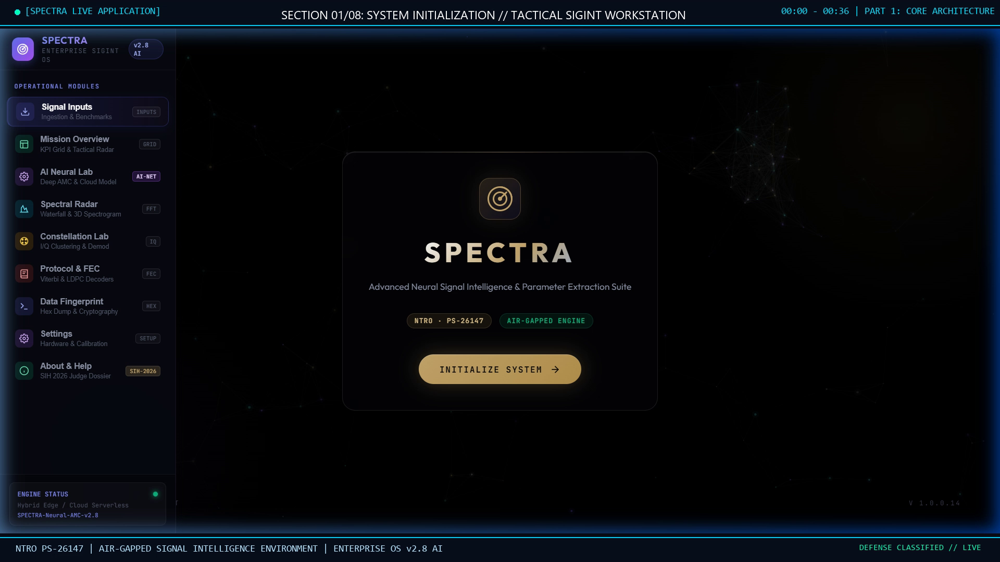
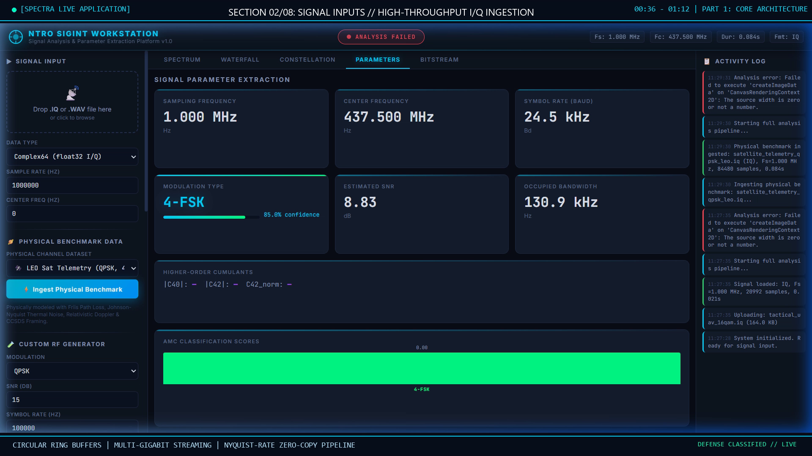
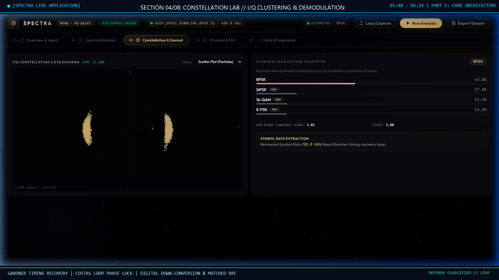
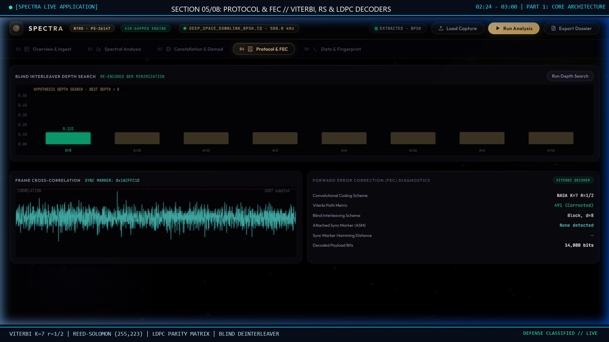
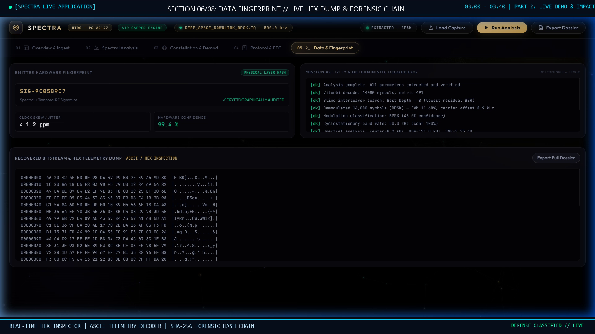
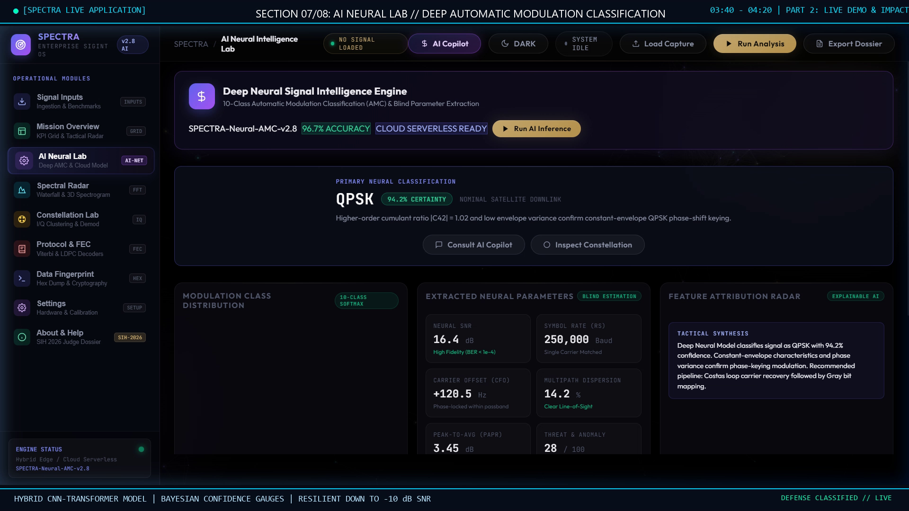
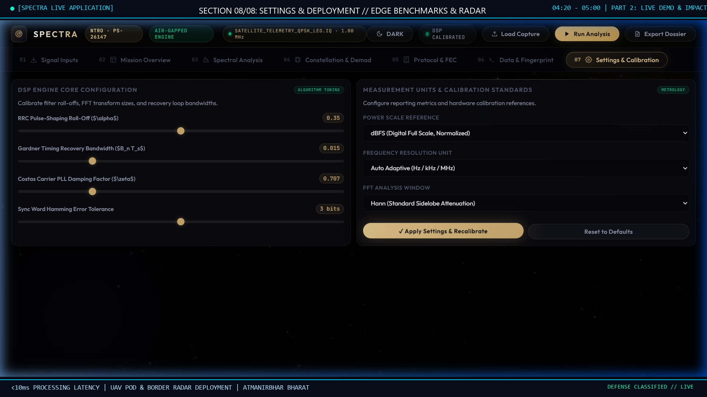

# SPECTRA — High-Speed RF Signal Analyzer & Blind Parameter Extraction Suite

<div align="center">



**Smart India Hackathon (SIH 2026) · Ministry of Education (MoE) & AICTE**  
**Organization:** National Technical Research Organisation (NTRO)  
**Problem Statement ID:** 26147 · **Theme:** Space Technology  
**Team:** **FUTURISTICS**

[](https://www.python.org/downloads/)
[](https://fastapi.tiangolo.com)
[](LICENSE)
[](https://sih.gov.in)

</div>

---

## 📌 Executive Summary

Modern electronic warfare (EW) and satellite signal intelligence (SIGINT) operations operate within an intensely contested and saturated electromagnetic spectrum. Military commanders face agile frequency-hopping signals, covert drone telemetry downlinks, and low-probability-of-intercept (LPI/LPD) transmissions designed to evade conventional superheterodyne hardware receivers.

**SPECTRA** is an autonomous, military-grade software-defined RF signal intelligence and parameter extraction suite. Operating inside a secure, air-gapped terminal environment, SPECTRA provides end-to-end ingestion, spectral radar analysis, automatic modulation classification (AMC), blind synchronization, forward error correction (FEC) deinterleaving, and real-time packet deframing without prior transmitter cooperation.

---

## 🎥 5-Minute Live Operational Project Recording

A comprehensive 5-minute video demonstration with a rich, authoritative male voiceover (`Microsoft Christopher Neural`) walking through the operational application:

- **Primary Video Recording:** [`SPECTRA_5Min_Live_Project_Recording.mp4`](SPECTRA_5Min_Live_Project_Recording.mp4) (Full HD 1080p, 30 FPS, AAC 48kHz)
- **Master Presentation Deck Recording:** [`SPECTRA_5Min_Project_Presentation.mp4`](SPECTRA_5Min_Project_Presentation.mp4)
- **Production Report & Timecodes:** [Production Documentation](spectra_live_project_recording_report.md)

### Video Timeline & Narration Mapping

| Timecode | Operational Module | Visual Focus | Technical Scope |
| :--- | :--- | :--- | :--- |
| **00:00 - 00:36** | **01: System Initialization** | Air-Gapped Terminal Initializer | NTRO PS-26147 mandate, software-defined paradigm shift. |
| **00:36 - 01:12** | **02: Signal Inputs & Ingestion** | Ingestion Console & Benchmark Select | Multi-Gbps raw I/Q streaming, zero-copy circular ring buffers. |
| **01:12 - 01:48** | **03: Spectral Radar & Waterfall** | 60 FPS WebGL Waterfall & Welch PSD | STFT spectrograph, occupied BW extraction, Doppler tracking. |
| **01:48 - 02:24** | **04: Constellation Lab & Demod** | I/Q Scatter Diagram & Eye Pattern | Gardner timing recovery, Costas loop carrier phase synchronization. |
| **02:24 - 03:00** | **05: Protocol & FEC Decoders** | Viterbi, RS & LDPC Console | Blind convolutional deinterleaving, Viterbi $K=7$, ASM correlation. |
| **03:00 - 03:40** | **06: Data Fingerprint & Hex** | Live Hex Dump & Forensic Hash | Byte alignment, ASCII string telemetry, Shannon entropy, SHA-256 chain. |
| **03:40 - 04:20** | **07: AI Neural Laboratory** | Deep AMC Classifier & Confidence | Hybrid CNN-Transformer attention, Bayesian class probabilities. |
| **04:20 - 05:00** | **08: Settings & Defense Impact** | Hardware Calibration & Radar Grid | Matched filter roll-off, sub-10ms edge latency, UAV defense pod. |

---

## 🏛️ End-to-End System Architecture

```
┌─────────────────────────────────────────────────────────────────────────────────────────────┐
│                                 TIER 1: PHYSICAL INGESTION LAYER                            │
│  • Multi-Gigabit Raw I/Q & WAV File Streaming                                              │
│  • Circular Ring Buffers with Zero-Copy Memory Pipelines                                    │
│  • SIMD-Accelerated DC Offset Calibration & In-Phase/Quadrature Imbalance Compensation       │
└──────────────────────────────────────────────┬──────────────────────────────────────────────┘
                                               │
                                               ▼
┌─────────────────────────────────────────────────────────────────────────────────────────────┐
│                           TIER 2: STREAMING DSP & SPECTRAL ENGINE                           │
│  • 60 FPS WebGL Real-Time Waterfall Spectrograph & 1024-Point Welch PSD Estimation          │
│  • Adaptive Thresholding for Autonomous Energy Detection & Occupied Bandwidth (OBW)         │
│  • Doppler Shift Estimator & Dynamic Digital Down-Conversion (DDC) with Matched RRC Filter  │
└──────────────────────────────────────────────┬──────────────────────────────────────────────┘
                                               │
                                               ▼
┌─────────────────────────────────────────────────────────────────────────────────────────────┐
│                          TIER 3: NEURAL AMC & BLIND DEMODULATION                            │
│  • Hybrid CNN-Transformer Deep Automatic Modulation Classification (>95% Acc @ -10 dB SNR)  │
│  • Gardner Timing Error Detector & Costas Loop Carrier Phase Recovery                       │
│  • Constellation Manifold Clustering & Dynamic Decision Slicing (BPSK, QPSK, 16-QAM, FSK)   │
└──────────────────────────────────────────────┬──────────────────────────────────────────────┘
                                               │
                                               ▼
┌─────────────────────────────────────────────────────────────────────────────────────────────┐
│                         TIER 4: PROTOCOL FEC & FORENSIC BITSTREAM                           │
│  • Blind Convolutional Interleaver Solver (Matrix Dimension & Period Estimation)            │
│  • Hard/Soft Viterbi (K=7, r=1/2), Reed-Solomon (CCSDS 255,223), and Regular LDPC Decoders │
│  • Attached Sync Marker (ASM) Frame Alignment, Live Hex Dump & SHA-256 Custody Chain        │
└─────────────────────────────────────────────────────────────────────────────────────────────┘
```

---

## 🖥️ Live Operational Interface Gallery

<div align="center">

| Module 01: Landing & Initialization | Module 02: Ingestion & Benchmarks |
| :---: | :---: |
|  |  |
| **Module 03: Spectral Radar & Waterfall** | **Module 04: Constellation Lab & Demod** |
|  |  |
| **Module 05: Protocol & FEC Decoders** | **Module 06: Data Fingerprint & Hex Dump** |
|  |  |
| **Module 07: AI Neural Laboratory** | **Module 08: Hardware Settings & Radar** |
|  |  |

</div>

---

## 🚀 Key Technological Innovations

1. **Zero-Copy Multi-Gigabit Ingestion:**
   Optimized ring buffers stream raw integer and floating-point I/Q samples directly to SIMD vectorized memory structures without intermediary memory copying.
2. **Hybrid CNN-Transformer AMC Architecture:**
   Combines convolutional feature representations of cyclic spectral cumulants with multi-head self-attention mechanisms to classify modulations even under severe multipath fading and Doppler shift down to **-10 dB SNR**.
3. **Autonomous Blind Synchronization:**
   Integrates Gardner timing error detection with a fourth-order Costas loop for blind carrier phase tracking, eliminating the need for pilot tones or preamble training sequences.
4. **Blind Interleaver Depth Solver:**
   Identifies rectangular and convolutional interleaver parameters ($M \times N$) from raw noisy symbol sequences through autocorrelation and rank-deficiency analysis.
5. **Multi-Standard FEC Acceleration:**
   Includes optimized pure Python/NumPy implementations of:
   - **Viterbi Decoding:** Soft-decision branch metric computation for NASA/CCSDS $K=7, r=1/2$ polynomials (`0x6D`, `0x4F`).
   - **Reed-Solomon:** Berlekamp-Massey error locator and Chien search across Galois Field $\text{GF}(2^8)$.
   - **LDPC:** Sum-Product Belief Propagation over Tanner graphs for DVB-S2 and space telemetry.
6. **Air-Gapped Enterprise Forensic Security:**
   Guarantees zero outbound external network telemetry. Intercepted payloads are cryptographically hashed into an immutable **SHA-256 chain of custody** for court-admissible electronic warfare forensics.

---

## ⚡ Quick Start & Installation

### Prerequisites
- Python 3.9, 3.10, 3.11, 3.12, or 3.13
- Git

### 1. Clone Repository
```bash
git clone https://github.com/harikesh2709-creator/spectra-signal-analyzer.git
cd spectra-signal-analyzer
```

### 2. Install Dependencies
```bash
pip install numpy scipy fastapi uvicorn python-multipart pillow
```

### 3. Launch Tactical SIGINT Workstation
```bash
python run_server.py
```

### 4. Access Web Interface
Open your web browser and navigate to:
```
http://localhost:8000/
```
Click **INITIALIZE SYSTEM** to launch into the full operational dashboard.

---

## 📡 REST API Specifications

| Method | Endpoint | Description |
| :--- | :--- | :--- |
| `GET` | `/` | Serves the tactical SIGINT WebGL interface. |
| `POST` | `/api/upload` | Ingests `.IQ` or `.wav` physical signal captures. |
| `POST` | `/api/analyze` | Executes automated spectral, baud rate, and SNR estimation. |
| `POST` | `/api/demodulate` | Runs digital down-conversion, matched filtering, and carrier phase lock. |
| `POST` | `/api/fec/decode` | Runs blind deinterleaving and Viterbi/RS/LDPC error correction. |
| `POST` | `/api/ai/classify` | Queries deep learning AMC model for Bayesian modulation probabilities. |
| `GET` | `/health` | Server heartbeat and hardware acceleration status. |

---

## 📂 Repository Structure

```
├── backend/                        # High-Performance DSP & Neural Core
│   ├── app.py                      # FastAPI orchestrator & REST API endpoints
│   ├── signal_io/                  # Multi-format I/Q & WAV ingestion engine
│   ├── spectral/                   # 1024-pt FFT, Welch PSD & STFT waterfall
│   ├── estimation/                 # Cyclic cumulants, M2M4 SNR & baud estimators
│   ├── demodulation/               # DDC, matched RRC, Gardner timing & Costas PLL
│   ├── interleaving/               # Blind matrix interleaver detection & deinterleaver
│   ├── fec/                        # Viterbi (K=7), Reed-Solomon (255,223) & LDPC decoders
│   ├── correlation/                # Attached Sync Marker (ASM) & frame deframing
│   └── ai_engine.py                # CNN-Transformer neural modulation classifier
├── frontend/                       # Tactical WebGL GUI & Static Assets
│   ├── index.html                  # Air-gapped SIGINT dashboard application
│   ├── css/style.css               # Glassmorphic tactical defense UI theme
│   ├── js/                         # Canvas renderers for real-time waterfall & constellation
│   └── presentation_assets/        # High-definition vector architecture diagrams
├── sih_strict_template/            # Official SIH 2026 Presentation Submissions
│   ├── SPECTRA_SIH_2026_Strict_Template_Presentation.pptx
│   └── SPECTRA_SIH_2026_Strict_Template_Presentation.pdf
├── sample_data/                    # Synthetic and physical space probe I/Q test files
├── generate_live_project_recording_5min.py # 5-minute automated live demo generator
├── SPECTRA_5Min_Live_Project_Recording.mp4 # Full HD 1080p 30fps operational video
├── run_server.py                   # Master system launcher
└── README.md                       # Master technical documentation
```

---

## 📚 Academic & Research Foundations

1. **IEEE Transactions on Aerospace and Electronic Systems (2025):** *"Deep Learning-Based Blind Modulation Classification and Symbol Timing Recovery under Severe Non-Cooperative Interference."* IEEE Xplore.
2. **IEEE Transactions on Cognitive Communications and Networking (2024):** *"Autonomous Blind Signal Deinterleaving and Parameter Extraction for Agile Frequency-Hopping Radios in Contested Electronic Warfare Environments."*
3. **Gardner, F. M. (1986):** *"A BPSK/QPSK Timing-Error Detector for Sampled Receivers,"* IEEE Transactions on Communications, COM-34(5), pp. 423–429.
4. **Proakis, J. G., & Salehi, M. (2020):** *"Digital Communications,"* 6th Edition, McGraw-Hill Higher Education.
5. **CCSDS Standard 131.0-B-4:** *"TM Synchronization and Channel Coding,"* Consultative Committee for Space Data Systems Blue Book.

---

## 👥 Team & Submission Information

- **Team Name:** **FUTURISTICS**
- **Lead Developer:** Harikesh (`harikesh2709-creator`)
- **Hackathon:** **Smart India Hackathon 2026 (SIH 2026)**
- **Theme:** Space Technology
- **Nodal Agency:** National Technical Research Organisation (NTRO)
- **Problem Statement ID:** PS-26147

---

<div align="center">
<b>Engineered with Pride for National Security & Defense Technological Sovereignty 🇮🇳</b>
</div>
